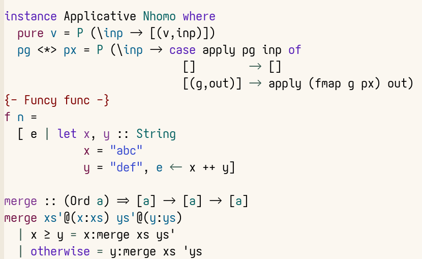

# haskell-ts-mode

A [Haskell](https://www.haskell.org/) mode that uses [Tree-sitter](https://tree-sitter.github.io/tree-sitter/).



The above screenshot is indented and coloured using `haskell-ts-mode`, with
`prettify-symbols-mode` enabled.

# Usage

-   `C-c C-r` Open REPL
-   `C-c C-c` Send code to REPL
-   `M-q`   Indent the function

# Features

Say it with me: Indentation does not change the syntax tree. This means that the
indentation is a lot more predictable, but sometimes you must manually press
`M-i` to indent.

Overview of features:

-   Syntax highlighting
-   Structural navigation
-   Indentation
-   Imenu support
-   REPL (`C-c C-r` in the mode to run)
-   Prettify Symbols mode support

# Comparison with `haskell-mode`

The more interesting features are:

-   Logical syntax highlighting:
    -   Only arguments that can be used in functions are highlighted, e.g., in `f
            (_:(a:[]))` only `a` is highlighted, as it is the only variable that is
        captured, and that can be used in the body of the function.
    -   The return type of a function is highlighted.
    -   All new variabels are (or should be) highlighted, this includes generators,
        lambda arguments.
    -   Highlighting the `=` operator in guarded matches correctly, this would be
        stupidly hard in regexp based syntax.
-   More performant, this is especially seen in longer files.
-   Much, much less code, `haskell-mode` has accumlated 30,000 lines of code and
    features to do with all things Haskell related. `haskell-ts-mode` just keeps
    the scope to basic major mode stuff, and leaves other stuff to external
    packages.

# Motivation

`haskell-mode` contains nearly 30k lines of code, and is about 30 years old. A
lot of features implemented by `haskell-mode` are now also available in standard
Emacs, and have thus become obsolete.

In 2018, a mode called [`haskell-tng-mode`](https://elpa.nongnu.org/nongnu/haskell-tng-mode.html) was made to solve some of these
problems. However, because of Haskell's syntax, it too became very complex and
required a web of dependencies.

Both these modes ended up practically parsing Haskell's syntax to implement
indentation, so I thought why not use Tree-sitter?

# Structural navigation

This mode provides strucural navigation, for Emacs 30+.

    combs (x:xs) = map (x:) c ++ c
      where c = combs xs

In the above code, if the pointer is right in front of the function
definition `combs`, and you press `C-M-f` (`forward-sexp`), it will take you to
the end of the second line.

# Installation

Add this into your init.el:
```lisp
(use-package haskell-ts-mode
  :ensure t
  :custom
  (haskell-ts-font-lock-level 4)
  (haskell-ts-use-indent t)
  (haskell-ts-ghci "ghci")
  (haskell-ts-use-indent t)
  :config
  (add-to-list 'treesit-language-source-alist
   '(haskell . ("https://github.com/tree-sitter/tree-sitter-haskell" "v0.23.1")))
  (unless (treesit-grammar-location 'haskell)
   (treesit-install-language-grammar 'haskell)))
```

That is all.  This will install the grammars if not already installed.
However, you might need to update the grammar version in the future.

# Customization

## How to disable `haskell-ts-mode` indentation

    (setq haskell-ts-use-indent nil)


## Pretify Symbols mode

`prettify-symbols-mode` can be used to replace common symbols with
unicode alternatives.

    (add-hook 'haskell-ts-mode 'prettify-symbols-mode)

## Adjusting font lock level

Set `haskell-ts-font-lock-level` accordingly.  Default value is 4, so if
you suffer from contagious dehydration, you can lower it.

## Language server

`haskell-ts-mode` works with `lsp-mode` and, since Emacs 30, with
`eglot`.

To add `eglot` support on Emacs 29 and earlier, add the following code
to your `init.el`:

    (with-eval-after-load 'eglot
      (defvar eglot-server-programs)
      (add-to-list 'eglot-server-programs
                   '(haskell-ts-mode . ("haskell-language-server-wrapper" "--lsp"))))

## Prettify sybmols mode

Turning on `prettify-symbols-mode` does stuff like turn `->` to `→`. If you
want to prettify words, set `haskell-ts-prettify-words` to non-nil.
This will do stuff like prettify `forall` into `∀` and `elem` to `∈`.

# TODO 

-   Support for M-x align, so that calling it will align all the 'equal'
    signs in a region.
-   Imenu support for functions with multiple definitions.


